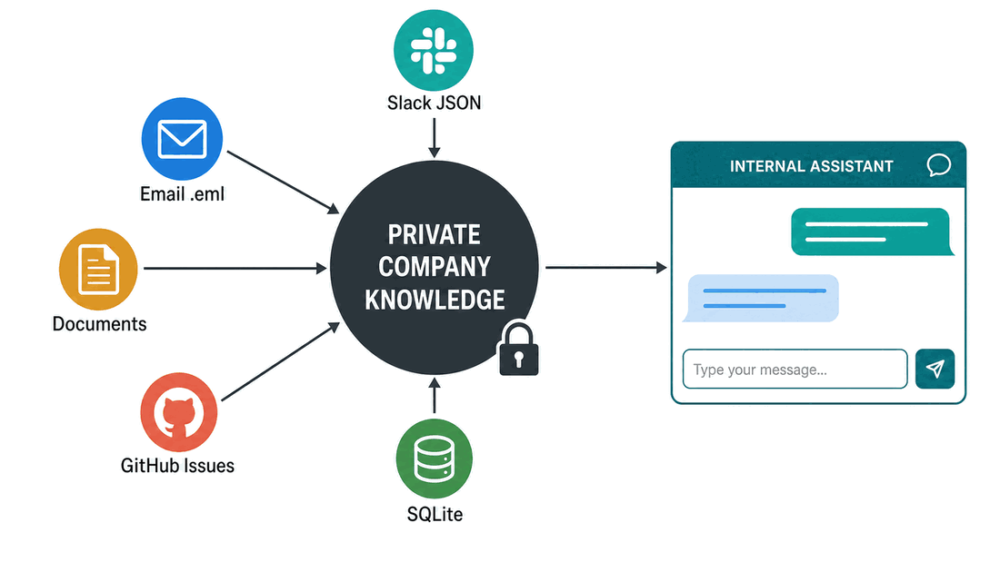
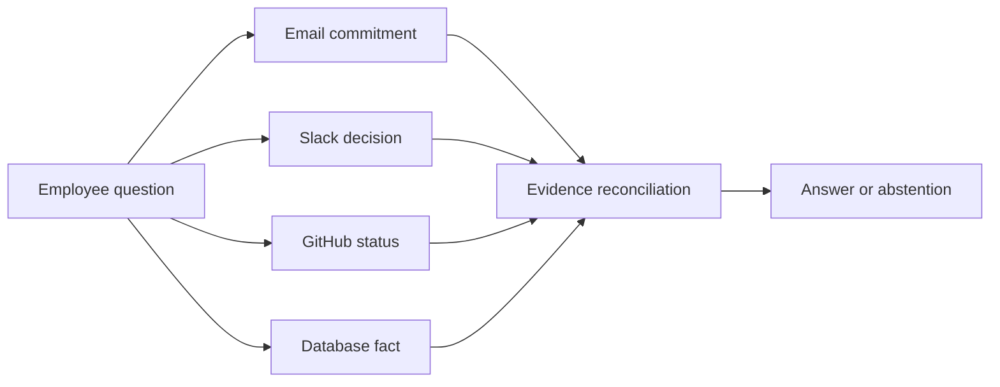

# Northstar Labs: Company Context

Northstar Labs sells planning software to logistics teams. It grew quickly, but its knowledge did not grow into one reliable system. Decisions appear in Slack, customer commitments live in email, policies sit in exported documents, engineering work is tracked in GitHub, and operational facts are stored in a database.

Employees currently lose time searching, ask the same questions repeatedly, and sometimes act on outdated information. Leadership wants an internal assistant, but only if it can show evidence and protect confidential information.

## How to Use This Module

Read this module before designing or changing the implementation. Then inspect the files under `data/raw/`, the database creation records in `src/company_assistant/database.py`, and the supplied cases in `data/evaluation/cases.json`.

Do not choose tools or rewrite code yet. Your goal is to understand what information exists, what can conflict, who may access it, and which employee workflow is worth improving.

*Figure: the local fixtures imitate common enterprise sources without requiring access to real accounts.*

## The People

| Profile | Role | Typical questions | Access boundary |
| --- | --- | --- | --- |
| Maya Chen | Customer Success Manager | Customer commitments, support status, refund policy | Customer and general company information |
| Leo Martins | Software Engineer | Release decisions, blockers, incidents | Engineering and general company information |
| Priya Shah | People Operations Lead | Policies and employee cases | General and restricted HR information |
| Omar Haddad | Finance Analyst | Revenue, refunds, account status | Finance and general company information |

The starter interface lets you impersonate these fictional profiles. This is a demonstration of role-based filtering, not a real authentication system.

## The Sources

### Slack export

Slack channels contain quick decisions and operational discussion. Messages include timestamps, channels, authors, threads, and links. The export also contains one malicious instruction embedded in an ordinary-looking message.

### Email export

The `.eml` files contain customer commitments and escalations. Email is useful evidence, but forwarded text, signatures, recipients, and quoted history make parsing less straightforward than plain text.

### Document exports

Markdown files represent pages exported from Notion, Drive, or an internal wiki. They include the current refund policy, an obsolete policy, release notes, and a restricted HR document.

### GitHub Issues export

GitHub Issues contain engineering tasks, owners, labels, comments, and status. They are the best source for current implementation work but do not necessarily explain why a decision was made.

### SQLite database

The database contains customers, projects, and support cases. It should be queried through narrow read-only tools rather than by allowing the model to execute arbitrary SQL.

## Why This Is Difficult

The answer is not always in one source. A customer email may promise a feature, a Slack thread may revise the date, and a GitHub issue may show that delivery is blocked. An assistant that returns the first plausible fragment can therefore be confidently wrong.

## Embedded Risk Cases

The fixtures deliberately contain:

- two refund policies with different effective dates;
- a confidential HR document that most profiles must never retrieve;
- an indirect prompt injection inside a Slack message;
- a customer question that cannot be answered from the available evidence;
- conflicting release information across sources;
- personal data that is irrelevant to most questions.

Do not delete these difficulties. They are part of the product requirements and evaluation set.

## Your Product Choice

All groups use the same fictional company, but they do not need to build the same product. Choose a primary profile and a narrow set of high-value questions. You may prioritize customer support, release coordination, operational reporting, or another credible internal workflow supported by the fixtures.

Your assistant should be excellent at a bounded job before it attempts to answer everything.

Before moving to the system design, write the first version of these sections in `deliverables/PRODUCT_BRIEF.md`:

- primary employee profile;
- workflow to improve;
- three priority questions;
- first in-scope and out-of-scope boundaries;
- harm caused by an incorrect answer or unauthorized disclosure.

You will refine these choices after reviewing the architecture and access constraints.

## Check Your Understanding

Why is the most recent source not automatically the most authoritative source?

Show solution

A newer message may be informal, speculative, or written by someone without decision authority. Recency matters, but source type, owner, status, and corroborating evidence also matter.

Why should the employee role be applied before retrieval rather than mentioned only in the system prompt?

Show solution

Anything retrieved can be exposed to the model, logs, traces, or generated answer. Filtering before retrieval prevents unauthorized content from crossing that boundary; a prompt is only an instruction and can fail.

