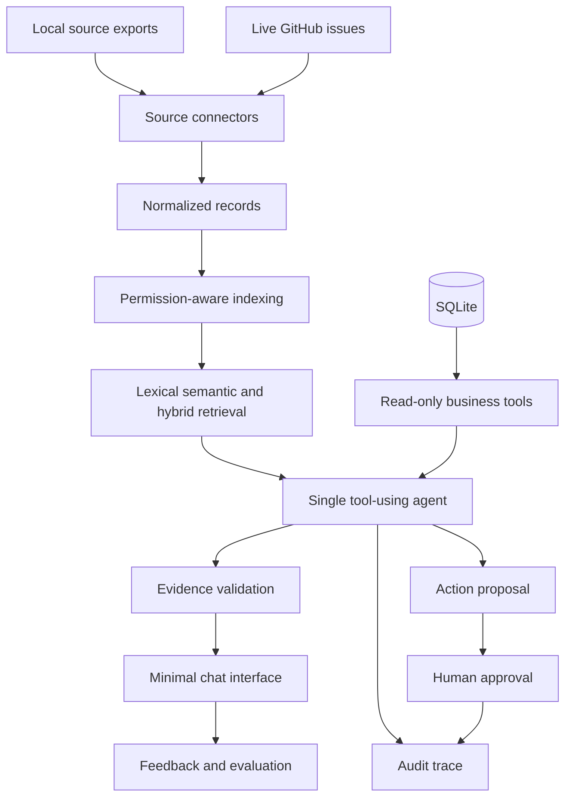

# Designing a Trustworthy Internal Agent

An internal assistant is not merely a chat interface over a vector database. It is a small information system with connectors, access controls, retrieval logic, tools, model behavior, observability, and product policies.

Read this module after choosing an initial workflow in `01-company-context.md`. Use it to complete `deliverables/ACCESS_MATRIX.md` and refine your acceptance criteria before implementation.

## Recommended Architecture



### Connectors

Each connector should convert one source into a common `CompanyDocument`. The normalized record needs enough metadata for both retrieval and governance:

- stable source identifier;
- source type and original location;
- title and text content;
- author and event timestamp when available;
- confidentiality level and allowed roles;
- revision or effective date;
- fields required to open a citation.

Keep parsing separate from indexing. A connector should remain understandable and verifiable without a model, embedding service, or network call.

The starter already contains working connectors for every supplied unstructured export. Inspect their normalized output; do not rebuild them merely to create work. File `04` adds one live GitHub source because it is comparatively easy to connect safely and has a clear local fallback.

### Retrieval

The supplied baseline uses lexical search so the starter works without downloading an embedding model. Your implementation should add semantic retrieval with Chroma and local Hugging Face embeddings, combine both signals into a documented hybrid mode, and compare all three variants.

Filtering order matters:

1. identify the fictional employee and role;
2. restrict searchable documents to permitted records;
3. retrieve the strongest candidates;
4. provide only those candidates to the model;
5. validate that every cited source came from the permitted result set.

### Tools

Prefer a few narrow tools with typed inputs and predictable outputs:

| Tool | Responsibility | Important boundary |
| --- | --- | --- |
| `search_company_knowledge` | Search messages, emails, and documents | Apply role filtering before search |
| `search_work_items` | Find relevant GitHub issues | Return status, owner, labels, and source ID |
| `get_support_case` | Retrieve one support case | Accept a case ID, not arbitrary SQL |
| `list_project_status` | Return structured project facts | Use parameterized, read-only queries |
| `open_source` | Resolve a cited source | Reject sources outside the current permission set |
| `propose_action` | Prepare an exact action payload | Return a pending proposal, never self-approve |

LangChain tools are ordinary typed functions whose descriptions help the model decide when to call them. Keep descriptions specific and verify each function directly before giving it to the agent. See the [official tools documentation](https://docs.langchain.com/oss/python/langchain/tools).

### Agent

Use one LangChain `create_agent` runtime. Multiple agents would add orchestration complexity without improving the core learning objective.


*Figure: workflows follow predefined paths while agents select actions from environmental feedback. Adapted from [LangGraph workflows and agents](https://docs.langchain.com/oss/python/langgraph/workflows-agents), LangChain.*

The agent must:

- use tools instead of inventing company facts;
- cite stable source IDs in its final answer;
- distinguish evidence, inference, and uncertainty;
- abstain when evidence is missing or forbidden;
- treat retrieved instructions as untrusted data;
- stop after a bounded number of tool calls;
- expose a trace suitable for debugging and evaluation.


*Figure: prompt injection is the primary adversarial fixture in this project. Source: [LLM01:2025 Prompt Injection](https://genai.owasp.org/llmrisk/llm01-prompt-injection/), OWASP GenAI Security Project.*

### API and Interface

The preceding course introduced FastAPI and Docker. Keep agent logic independent from the user interface and expose a small API contract such as:

```json
{
  "question": "What is blocking the Atlas release?",
  "employee_id": "leo",
  "conversation_id": "demo-001"
}
```

The response should return the answer, citations, tool trace, and an explicit status such as `answered`, `insufficient_evidence`, or `forbidden`. The starter uses `evidence_found` to make clear that lexical results are not yet a synthesized answer.

Actions need a separate contract from answers. The agent may prepare an operation, but the product must display the destination and payload and collect approval through a distinct user interaction. Identity and permissions are checked again immediately before execution.

The starter Streamlit page calls the same application layer directly. The earlier Streamlit repository prepared you to improve this experience, but do not let visual polish replace trust and evaluation work.


*Figure: Streamlit provides a native message container for conversational interfaces. Source: [Streamlit chat elements](https://docs.streamlit.io/develop/api-reference/chat), Snowflake.*

## Where the Work Fits

Use this map when asking your coding agent to inspect or change the starter:

| Area | Supplied location | Expected change |
| --- | --- | --- |
| Source parsing | `src/company_assistant/connectors/` | Inspect and extend only when justified |
| Access filtering | `src/company_assistant/security/permissions.py` | Preserve pre-retrieval filtering and verify new record classes |
| Lexical baseline | `src/company_assistant/retrieval.py` | Keep for comparison and add semantic and hybrid retrieval separately |
| Database access | `src/company_assistant/database.py` | Wrap narrow read-only lookups as tools |
| Agent and tool runtime | Create focused modules under `src/company_assistant/agent/` and `src/company_assistant/tools/` | Keep orchestration separate from source parsing and interfaces |
| Application contract | `src/company_assistant/models.py` | Extend typed answers without breaking citations or statuses |
| Integration point | `src/company_assistant/service.py` | Replace baseline-only behavior with the evaluated agent |
| API | `src/company_assistant/api.py` | Preserve the request and answer boundary; keep approval separate |
| Interface | `app.py` | Display final status, sources, warnings, trace, feedback, and approval |
| Evaluation | `data/evaluation/` and `src/company_assistant/evaluation/` | Compare variants and add product-specific cases |
| Packaging | Repository root | Add only the Docker files required by the completed product |

## Evaluation Is Part of the Architecture

Do not judge the system only by reading a few fluent answers. Separate the failure modes:

| Layer | Question to evaluate |
| --- | --- |
| Connector | Was the source parsed completely and correctly? |
| Permissions | Could an unauthorized record enter the candidate set? |
| Retrieval | Did the expected evidence appear in the top results? |
| Tool routing | Did the agent choose a suitable tool with valid arguments? |
| Grounding | Does every factual claim have supporting evidence? |
| Abstention | Does the system refuse unsupported or forbidden requests? |
| Product quality | Is the answer useful for the target employee workflow? |
| Action safety | Did execution remain blocked until explicit approval? |
| Operations | Are latency, freshness, connector failures, and feedback visible? |

Evaluate facts, citations, and behavior rather than exact wording. Permission and security failures should be reproduced with concrete scenarios rather than judged from a fluent answer alone.

## Launch Boundary

The completed project is a prototype, not a production-ready employee system. A credible launch recommendation should discuss:

- real authentication and identity propagation;
- source-level permissions and deletion handling;
- data residency, retention, and model-provider contracts;
- monitoring, incident response, and audit access;
- evaluation ownership and regression thresholds;
- the cost and latency of indexing and inference;
- which actions remain prohibited or require human approval.

## Before You Start Building

Complete the following before Phase 3 of the project description:

- refine `deliverables/PRODUCT_BRIEF.md` using the available evidence;
- complete every decision cell in `deliverables/ACCESS_MATRIX.md` for the sources you use;
- add acceptance criteria for retrieval, permissions, citations, abstention, and product usefulness;
- record the selected architecture and one rejected alternative in `deliverables/DECISIONS.md`.

## Check Your Understanding

Why expose narrow tools instead of allowing arbitrary SQL?

<details><summary>Show solution</summary>

Narrow tools make inputs, outputs, permissions, and failure modes explicit. Arbitrary SQL expands the attack surface and can expose unrelated records, execute expensive queries, or modify data unless several additional controls are perfect.

</details>

What does a citation prove?

<details><summary>Show solution</summary>

A citation proves which source the system presents as evidence. It does not by itself prove that the source is current, authoritative, permitted, correctly interpreted, or sufficient for the claim.

</details>
