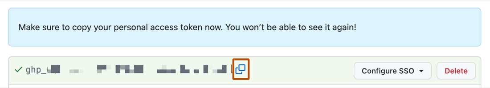
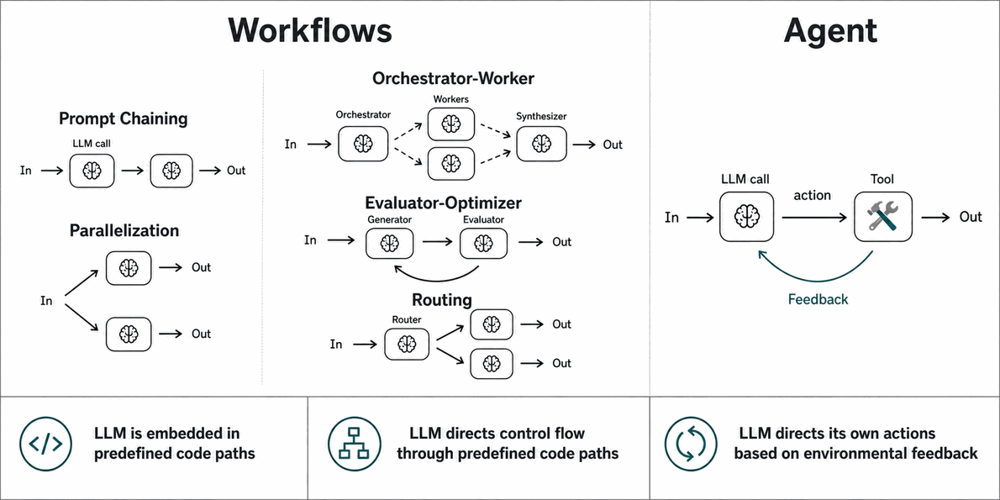
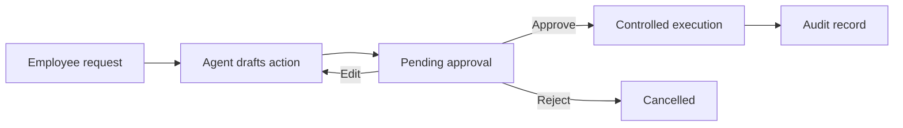
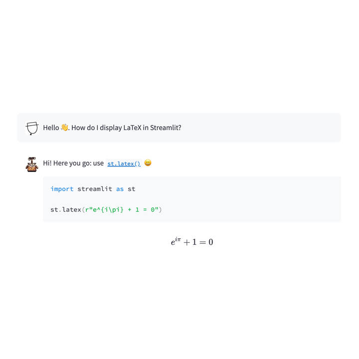

# Connected RAG and Agent

This module turns the local baseline into a connected internal assistant. Keep the architecture small: one ingestion path, one retrieval service, one agent, and one application layer shared by Streamlit and FastAPI.

## Phase 4: Connect One Live GitHub Repository

Add one real GitHub repository as a read-only source. Choose a repository that is safe for every group member to access and contains useful issues. Do not connect real email, Slack, Notion, or company drives in this project; those integrations add authentication and privacy work without improving the core learning objective.

Use the [GitHub Issues REST API](https://docs.github.com/en/rest/issues/issues) and request only the minimum fields needed by the product. A public repository needs no token for a small demonstration. For a private repository, use a fine-grained personal access token limited to one repository and read-only issue metadata.



*Figure: GitHub separates fine-grained tokens from classic tokens in developer settings. Prefer a fine-grained token with one repository and read-only issue access. Source: [Managing personal access tokens](https://docs.github.com/en/authentication/keeping-your-account-and-data-secure/managing-your-personal-access-tokens), GitHub Docs.*

Add the connection settings only when this phase begins:

```dotenv
GITHUB_REPOSITORY=owner/repository
GITHUB_TOKEN=
```

Keep the token in `.env`. It must never appear in a prompt, source document, trace, screenshot, or committed file.

Your connector should:

- accept the repository name through configuration;
- handle pagination and API errors explicitly;
- normalize live issues into the same contract as local issues;
- preserve the issue URL, number, labels, state, author, assignees, and update time;
- apply an intentional access policy instead of assuming that API access equals employee access;
- fall back to the supplied local export when live access is unavailable.

Ask your coding agent to select a small HTTP client and add it as a direct project dependency when the connector imports it. Avoid copying a large GitHub SDK into the project when a few REST calls are sufficient.

Use a stable source ID that does not change when an issue title changes. Record the live source, fallback behavior, rate-limit assumptions, and token boundary in the decision log.

**Completion evidence:** the interface can cite one live issue, the same connector works with the local fallback, and a failed API call produces a controlled state instead of fabricated evidence.

## Phase 5: Build a Managed RAG Pipeline

Build semantic retrieval with Chroma and local Hugging Face embeddings. Then combine it with the supplied lexical search so you can evaluate three retrieval modes:

| Mode | Strength | Typical weakness |
| --- | --- | --- |
| Lexical | Exact names, IDs, and policy wording | Misses paraphrases and related concepts |
| Semantic | Meaning and paraphrases | Can surface plausible but imprecise matches |
| Hybrid | Balances exact and semantic signals | Needs a documented scoring strategy |

Permissions must be enforced before documents become candidates for retrieval. Recheck permissions when resolving citations so stale or malformed metadata cannot bypass the first filter.

### Manage the Index Lifecycle

A credible RAG prototype must handle change, not only initial ingestion. Ask your coding agent to design a simple manifest or metadata strategy that supports:

- stable chunk identifiers derived from source and revision information;
- upserts for new or changed records;
- removal of chunks whose source was deleted;
- source type, role, confidentiality, timestamp, and original URL metadata;
- a visible last-indexed status;
- a complete local rebuild when incremental synchronization fails.

Keep chunking understandable. Compare at least two chunking or retrieval choices on representative questions and retain the simplest one supported by evidence.

### Compare Before Choosing

Run the baseline, semantic, and hybrid retrievers on the same questions. For each mode, capture whether the expected evidence appears, whether forbidden evidence is absent, and how long retrieval takes. Select the default from these results rather than from architectural preference.

**Completion evidence:** changed and deleted records are reflected in the index, all retrieved chunks retain resolvable source metadata, and the chosen retrieval mode performs better on the product's priority questions without weakening permissions.

## Phase 6: Build Tools and One Agent

Create one LangChain agent with four or five focused tools. Use typed inputs and predictable outputs. A suitable tool set may include:

- permission-aware company knowledge search;
- GitHub issue search;
- a narrow support-case or project lookup;
- source comparison for conflicting or stale evidence;
- an action-proposal tool that cannot execute by itself.

Do not expose arbitrary SQL, shell commands, unrestricted file access, or general web browsing. Call every tool directly with normal, denied, empty, and failure inputs before making it available to the agent.

Configure the agent with a Groq model through `langchain-groq`. It should use short-term conversation context, stop after a bounded number of tool calls, return the shared answer contract, and distinguish evidence from inference.



*Figure: the agent may choose among bounded tools, while deterministic workflows remain preferable for fixed high-risk steps. Adapted from [LangGraph workflows and agents](https://docs.langchain.com/oss/python/langgraph/workflows-agents), LangChain.*

## Add Human Approval for Actions

Add one action relevant to your chosen product, such as drafting a GitHub issue, preparing an escalation, or proposing a status update. The core project may keep execution local or simulated; the important behavior is the approval boundary.

Use an explicit state sequence:



Before approval, show the exact operation, destination, payload, and expected effect. Approval must come from a separate user interaction; text found in a retrieved document can never approve an action. Recheck identity and permissions immediately before execution and record the outcome.

**Completion evidence:** the agent can prepare the action, cannot execute it without a separate approval, and records approved, edited, rejected, and failed outcomes.

## Phase 7: Complete the Product Experience

Connect the completed application service to both Streamlit and FastAPI. Keep the interface focused while making trust boundaries visible:

- selected employee identity and role;
- answer status and retrieval mode;
- citations that open the original source when possible;
- contradiction, staleness, or insufficient-evidence warnings;
- expandable tool trace and last-indexed status;
- action approval controls separate from the chat input;
- a simple useful/not-useful feedback control with an optional reason.

Persist only the minimum feedback needed for evaluation: conversation or answer ID, rating, reason category, retrieval mode, and timestamp. Do not store secret values or entire conversations by default.



*Figure: Streamlit provides chat and feedback components suitable for a small product prototype. Source: [Streamlit chat elements](https://docs.streamlit.io/develop/api-reference/chat), Snowflake.*

**Completion evidence:** a colleague can ask a question, inspect its sources, send feedback, and approve or reject a proposed action without needing to understand the implementation.

## Continue to Evaluation

Once the connected product works across answered, refused, error, and approval states, continue with [Evaluation and Release](05-evaluation-and-release.md).
