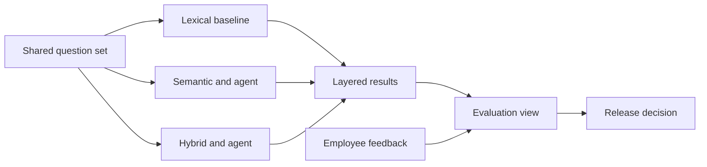

# Evaluation and Release

The final module turns a working prototype into an evidence-based product decision. A fluent demonstration is not enough: compare the system variants, expose failures, package the application, and explain what would still block real company use.

## Phase 8: Run a Comparative Evaluation

Run every supplied case and add cases for your selected workflow, the live GitHub source, index updates, feedback, and human approval. Evaluate behavior rather than exact wording.

Compare at least these variants on the same question set:

1. lexical baseline without a model;
2. semantic retrieval with the agent;
3. hybrid retrieval with the agent.

Record results by layer in `deliverables/EVALUATION_REPORT.md`:

- expected evidence retrieved;
- forbidden evidence absent;
- suitable tool selected;
- factual claims supported by citations;
- correct abstention or refusal;
- action held for approval;
- retrieval and end-to-end latency;
- user feedback when available.

Permission leaks and unapproved actions are release blockers, regardless of the overall average. For other measures, define thresholds before reading the final results so the decision is not adjusted to fit the outcome.

### Build a Small Evaluation View

Add a compact Streamlit view or page that makes the comparison inspectable. It should show:

- pass, partial, and fail counts by category;
- lexical, semantic, and hybrid retrieval success;
- latency by variant;
- useful versus not-useful feedback;
- the most important unresolved failures.

The dashboard can read a simple local JSON or CSV result file under `data/generated/`. This folder is ignored because results depend on each group's product and model configuration. It does not need a separate analytics platform.

**Completion evidence:** another group can inspect the dashboard, trace a failed case back to evidence, and understand why one system variant was selected.

## Phase 9: Package the Product

Containerize the completed product using the principles from the preceding API and Docker repository. Keep the packaging modest: the application, its API, required local data, and documented environment variables.

The containerized version should:

- start from a clean checkout using documented commands;
- expose the intended Streamlit and FastAPI ports;
- keep secrets outside the image;
- preserve the local GitHub fallback;
- make persistent index and feedback locations explicit;
- provide a lightweight health endpoint that does not call the model.

Do not claim production readiness because the application runs in a container. Authentication, secret management, backups, monitoring, provider contracts, and source-level authorization remain separate decisions.

**Completion evidence:** a teammate can start the packaged product from the repository instructions and reach both interfaces without repairing paths or manually copying hidden files.

## Phase 10: Decide and Demonstrate

Complete `deliverables/SHOWCASE.md`, `deliverables/EVALUATION_REPORT.md`, and the final decision entry in `deliverables/DECISIONS.md`.

Use this demonstration sequence:

1. explain the employee problem and chosen scope;
2. show one grounded multi-source answer;
3. open the citations and tool trace;
4. show one refusal, conflict, or injection-resistance case;
5. propose an action and demonstrate the approval boundary;
6. compare the three retrieval variants in the evaluation view;
7. present the release recommendation and remaining risks.

Choose one recommendation:

- demonstrate;
- demonstrate with explicit limitations;
- do not demonstrate yet.

The decision must follow the evidence. A polished interface does not compensate for a permission leak, fabricated answer, or action executed without approval.

## Optional Extensions

Only begin these after the required evaluation is complete. Choose one or two options that address an observed limitation. Record the baseline, implement the extension, and show whether it improved the product.

### Add Another Company Source

| Option | What to build | Evidence to show |
| --- | --- | --- |
| Notion export | Parse an exported Markdown or HTML workspace without OAuth. Preserve page titles, paths, update dates, and parent-child relationships. See [Export your content](https://www.notion.com/help/export-your-content). | One cross-page answer, one updated page reflected in the index, and one deleted page removed. |
| Slack export | Parse an exported workspace while preserving channels, threads, authors, and timestamps. See [Export your workspace data](https://slack.com/help/articles/201658943-Export-your-workspace-data). | One answer that reconstructs a thread and one channel the selected role cannot search. |
| GitHub pull requests | Extend the live connector to include pull requests, reviews, and comments through the [GitHub Pull Requests API](https://docs.github.com/en/rest/pulls/pulls). | One answer combining an issue with its implementation or review status, with links to both. |
| Shared-drive folder | Ingest a local folder containing exported PDF, DOCX, and Markdown files. Treat the folder as a safe substitute for a live Google Drive connection. | A file-type comparison, a controlled parsing failure, and citations that identify the original files. |
| Jira Cloud | Add read-only issue retrieval for one project using the [Jira Cloud REST API](https://developer.atlassian.com/cloud/jira/platform/rest/v3/intro/). Keep a local JSON fallback. | Pagination, rate-limit or authentication failure handling, and one cross-source GitHub/Jira answer. |

Prefer exports and read-only APIs. Do not add a live connector that requires every group member to share personal credentials or upload real company data.

### Evaluate with Ragas

Add [Ragas](https://docs.ragas.io/en/stable/concepts/metrics/available_metrics/) only after the behavior-oriented evaluation works. Ask your coding agent to add it as a direct dependency only if you select this extension. Create a small evaluation dataset containing questions, generated answers, retrieved contexts, and reference answers or contexts where required.

Compare the semantic and hybrid versions with:

- **Faithfulness** to estimate whether claims are supported by retrieved context;
- **Context Precision** to measure how much retrieved context is relevant;
- **Context Recall** to measure whether the expected evidence was retrieved;
- **Response Relevancy** to assess whether the answer addresses the question.

Run the same fixed dataset and configuration for both variants. Add the results to `deliverables/EVALUATION_REPORT.md`, including metric values, evaluation model, cost, latency, and at least two examples where the automated score disagrees with human review. Ragas does not replace permission, prompt-injection, or action-approval scenarios; a system with a data leak still fails regardless of its average score.

### Improve Retrieval

| Option | What to build | Evidence to show |
| --- | --- | --- |
| Reranking | Rerank the hybrid candidate set with a local cross-encoder before sending context to the agent. | Top-result quality and latency before and after reranking on the same questions. |
| Freshness-aware ranking | Add an explicit effective-date or recency signal without automatically treating the newest source as authoritative. | The conflicting refund-policy and Atlas-date cases before and after the change. |
| Query decomposition | Split a complex question into bounded subquestions, retrieve each separately, then synthesize the evidence. | One cross-source question that improves and one simple question where decomposition is unnecessary. |
| Better chunking | Compare fixed-size chunks with source-aware chunks for messages, policies, and issues. | Context precision, citation quality, index size, and latency for both strategies. |

### Strengthen the Product

| Option | What to build | Evidence to show |
| --- | --- | --- |
| Feedback triage | Turn not-useful feedback into categories such as missing source, incorrect answer, stale evidence, or poor citation. | A small product-owner view and one decision made from collected feedback. |
| Approved GitHub action | Execute an approved issue creation with a separate narrowly scoped token. Keep draft, approval, execution, and failure events in an audit record. | Rejected, edited, approved, and failed actions; no execution from chat text alone. |
| Deterministic RAG comparison | Implement a fixed retrieve-then-generate workflow using the same retriever and model as the agent. | Quality, latency, tool use, and failure comparison on the same cases. |

### Build a More Advanced Interface

Replace Streamlit only when the required product and evaluation already work. Keep the application service and FastAPI contracts independent from the interface so the migration does not require rebuilding retrieval or agent logic.

| Option | What to build | Evidence to show |
| --- | --- | --- |
| Chainlit | Replace the chat page with [Chainlit](https://docs.chainlit.io/get-started/overview). Use its steps, actions, feedback, and authentication capabilities to display tool activity and approval requests more naturally. | The same three product scenarios in Streamlit and Chainlit, plus one interaction that is clearer or safer in Chainlit. |
| React or Next.js | Build a separate frontend using the [Next.js App Router](https://nextjs.org/docs/app) or another React setup. Call the existing FastAPI service and add streaming, a citation side panel, an approval inbox, conversation navigation, and a responsive evaluation view. | A complete user journey, controlled API errors, responsive layouts, and no agent or permission logic duplicated in the browser. |

Do not replace Streamlit only for visual novelty. Choose the advanced interface to support a concrete product need such as multiple conversations, richer source inspection, real authentication, accessible action approval, or a clearer evaluation dashboard.

### Compare Another Model Provider

Keep prompts, tools, retrieval results, model parameters, and evaluation cases fixed. Put the chat model behind one small application boundary, then compare Groq with one alternative:

| Provider | Integration | Question to investigate |
| --- | --- | --- |
| Mistral AI | Use the official LangChain [ChatMistralAI integration](https://docs.langchain.com/oss/python/integrations/chat/mistralai) with `MISTRAL_API_KEY`. | Does a directly hosted Mistral model change answer quality, tool selection, latency, cost, or governance constraints? |
| OpenRouter | Use the official LangChain [ChatOpenRouter integration](https://docs.langchain.com/oss/python/integrations/chat/openrouter) with `OPENROUTER_API_KEY`. OpenRouter is a gateway, so record both the selected model and the underlying provider. | Does access to another model or routing option improve the measured product without making cost, privacy, or failure behavior less predictable? |

Ask your coding agent to add `langchain-mistralai` or `langchain-openrouter` as a direct dependency only when that option is selected. Compare grounded-answer quality, tool-call success, structured-output validity, abstention, latency, token cost, provider errors, and relevant data-handling terms. Conclude with a provider recommendation for this product rather than declaring one model universally better.

### Improve Operations and Governance

| Option | What to build | Evidence to show |
| --- | --- | --- |
| Trace and cost view | Store minimal local traces with model, tools, latency, token use, status, and error category. | A dashboard that identifies the slowest path and most common failure without storing secrets or full private conversations. |
| Resilient synchronization | Add background synchronization, retry limits, last-success status, and a complete rebuild path. | Recovery from an interrupted update without duplicate or stale chunks. |
| Data-retention controls | Add configurable retention for feedback, traces, and generated indexes plus a deletion operation. | A record removed from every relevant store and an audit entry that contains no deleted content. |
| Real authentication | Replace the fictional selector with authentication and propagate verified identity into retrieval, tools, actions, and traces. | Two authenticated users receive different permitted results for the same question. |

Do not add multiple agents merely to make the architecture look more advanced. Add complexity only when evaluation evidence shows that it solves a real limitation.

## Final Review

Ask your coding agent to review correctness, security, privacy, maintainability, documentation, and unresolved risks. Verify its claims yourself. Remove credentials, local caches, generated indexes, and personal data before presenting the repository.
