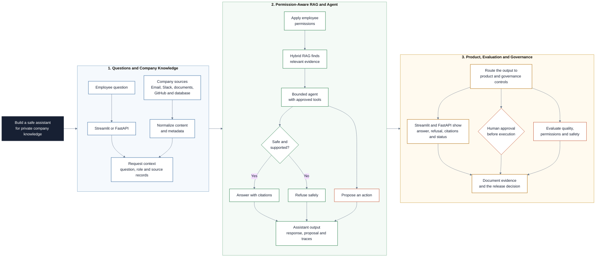

# Internal Company AI Agent Project

This project brings together connected data, retrieval-augmented generation, tool-using agents, APIs, Streamlit, Docker, and product decision-making. You will direct a coding agent to build a trustworthy internal assistant for a fictional company whose knowledge is spread across messages, documents, work items, and a database.

It is designed as the synthesis project after the AI Agent, API and Docker, and Streamlit repositories. The starter already loads the fictional sources, applies a basic role filter, exposes a FastAPI endpoint, and displays results in Streamlit. Your task is to turn that transparent baseline into an evaluated tool-using agent.

## Project at a Glance

The goal is to build an internal assistant that lets employees question private
company knowledge without exposing information they are not allowed to access.



## Learning Objectives

By the end of this project, you should be able to:

- Turn an internal business problem into a measurable AI product scope.
- Normalize information from local fixtures and one live read-only source.
- Compare lexical, semantic, and hybrid retrieval using shared evidence.
- Manage document updates and deletions in a permission-aware index.
- Give an agent focused, read-only tools instead of unrestricted system access.
- Place explicit human approval between an agent proposal and an action.
- Enforce employee permissions before information reaches the language model.
- Build answers that remain traceable to their original evidence.
- Evaluate retrieval, tool selection, abstention, feedback, conflicts, and security separately.
- Package and demonstrate the product with an evidence-based release decision.
- Direct Claude Code or Codex while retaining responsibility for product and release decisions.

## Learning Path

The modules build on each other in order. Complete the setup first, then follow the sequence and retain the requested completion evidence.

| Order | File | What to do | Output |
| --- | --- | --- | --- |
| 1 | [**Company Context**](01-company-context.md) | Understand Northstar Labs, inspect its sources, and choose one primary employee workflow. | Initial product direction |
| 2 | [**System Design**](02-system-design.md) | Understand the starter architecture, trust boundaries, tools, and evaluation layers. | Architecture and access decisions |
| 3 | [**Project Description**](03-project-description.md) | Frame the product, define its information boundary, and establish the baseline. | Approved scope and baseline evidence |
| 4 | [**Connected RAG and Agent**](04-connected-rag-and-agent.md) | Add a live source, managed hybrid retrieval, tools, the agent, approval, and feedback. | Connected product prototype |
| 5 | [**Evaluation and Release**](05-evaluation-and-release.md) | Compare variants, inspect feedback, package the product, and make the release decision. | Evaluated product demonstration |

## Starter and Required Work

| Already supplied | You must build or complete |
| --- | --- |
| Fictional Slack, email, document, GitHub, and SQLite data | A narrow product scope for one primary employee profile |
| Working parsers for all unstructured source exports | One live read-only GitHub source with a local fallback |
| Deterministic role filtering and lexical retrieval | At least four narrow tools with explicit boundaries |
| Reproducible database and one narrow lookup function | Managed semantic and hybrid retrieval plus at least four narrow tools |
| FastAPI and Streamlit starter boundaries | One bounded agent, human approval, feedback, and visible system status |
| Twelve evaluation scenarios | Comparative dashboard, containerized product, and release decision |

### Additional Folders and Files

| File / Folder | Description |
| --- | --- |
| [**Raw Data**](data/raw/) | Fictional Slack, email, document, and GitHub exports. |
| [**Business Database**](data/database/company.db) | Generated SQLite database containing projects, customers, and support cases. |
| [**Evaluation Cases**](data/evaluation/cases.json) | Required questions, risks, expected sources, and access outcomes. |
| [**Source Package**](src/company_assistant/) | Starter connectors, baseline search, API, permissions, and evaluation helpers. |
| [**Deliverables**](deliverables/) | Templates for the product brief, access matrix, decision log, evaluation report, and showcase. |
| [**Agent Instructions**](AGENTS.md) | Shared working rules for coding agents. |
| [**Claude Code Instructions**](CLAUDE.md) | Claude Code entry point that delegates to the shared rules. |
| [**Assets**](assets/) | Architecture and governance illustrations used by the project. |
| [**pyproject.toml**](pyproject.toml) | Python 3.13 project metadata and dependencies. |
| [**uv.lock**](uv.lock) | Reproducible dependency lock file. |

## Setup

> [!NOTE]
> Text in angle brackets such as `<repo-name>` is a placeholder. Replace it with your own value.

### 1. Create the Repository from the Template

Click **Use this template** on GitHub. Choose an owner and repository name, disable **Include all branches**, and create the repository.

> [!IMPORTANT]
> For pair or group work, only one person creates the repository.

### 2. Add Collaborators

For group work, open **Settings -> Collaborators**, add your teammates, and wait for them to accept the invitation.

### 3. Clone the Repository

Copy the SSH URL from the **Code** button and run:

```bash
git clone <copied-ssh-url>
```

### 4. Install Dependencies

```bash
cd <repo-name>
uv sync
```

This installs the locked dependencies and creates `.venv/`.

### 5. Initialize the Starter

```bash
uv run python -m company_assistant.database
```

This recreates the fixed teaching database used by the starter.

### 6. Run the Starter Interfaces

Start the Streamlit app:

```bash
uv run streamlit run app.py
```

The app opens at `http://localhost:8501`. Select different fictional employees and ask the same question to observe the permission-aware lexical baseline. The baseline displays evidence but deliberately does not generate a synthesized answer.

Keep Streamlit running and start the API in a separate terminal:

```bash
uv run uvicorn company_assistant.api:app --reload
```

Open `http://localhost:8000/docs` to call the starter endpoints through FastAPI's interactive documentation.

### 7. Read the Project Files in Order

Return to the [Learning Path](#learning-path). Read and complete files `01` through `05` in order. Use `app.py` to inspect the baseline during file `03`, then evolve the same interface during file `04`.

Do not begin by changing the prompt or replacing the whole starter. First define the product, inspect the fixtures, run the baseline, and establish what must improve.

### 8. Configure the Model When You Reach the Agent Phase

The baseline does not require external credentials. When you reach the connected-source and agent phases in file `04`, create your local environment file:

```bash
cp .env.example .env
```

Add your Groq API key and, when needed, the GitHub repository settings described in file `04`. Never commit `.env` or expose credentials in prompts, screenshots, traces, or evaluation reports.

## Coding Agent Collaboration

Use Claude Code or Codex through any interface that can access the repository. At the beginning of each project phase, give it the phase objective and ask it to inspect the relevant files before proposing a plan. Let it perform most implementation work, but review its plan, changes, assumptions, and evidence before accepting the result and moving forward.

You remain accountable for the product scope, access policy, acceptance criteria, evidence quality, and final release decision. Never provide real company data, credentials, or personal information to the project.

## References & Further Reading

- [LangChain agents](https://docs.langchain.com/oss/python/langchain/agents)
- [LangChain tools](https://docs.langchain.com/oss/python/langchain/tools)
- [FastAPI tutorial](https://fastapi.tiangolo.com/tutorial/)
- [Streamlit chat elements](https://docs.streamlit.io/develop/api-reference/chat)
- [OWASP prompt injection](https://genai.owasp.org/llmrisk/llm01-prompt-injection/)
- [NIST AI Risk Management Framework](https://www.nist.gov/itl/ai-risk-management-framework)
- [Slack export documentation](https://slack.com/help/articles/220556107-How-to-read-Slack-data-exports)
- [GitHub REST API for issues](https://docs.github.com/en/rest/issues/issues)
- [GitHub fine-grained personal access tokens](https://docs.github.com/en/authentication/keeping-your-account-and-data-secure/managing-your-personal-access-tokens)
- [Chroma update and delete operations](https://docs.trychroma.com/docs/collections/update-data)
- [LangChain human-in-the-loop middleware](https://docs.langchain.com/oss/python/langchain/human-in-the-loop)
- [Docker containerize a Python application](https://docs.docker.com/guides/python/containerize/)

## License

[MIT License](LICENSE)
